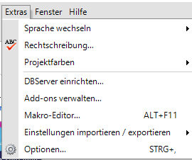
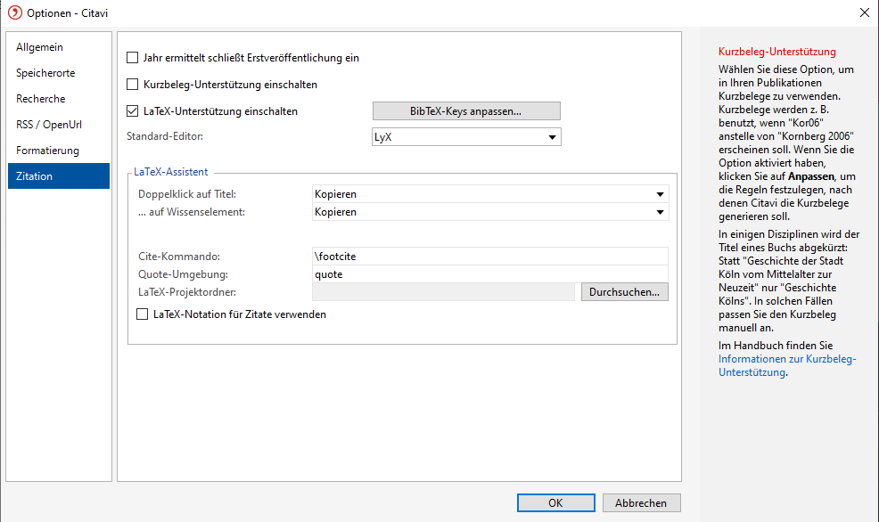
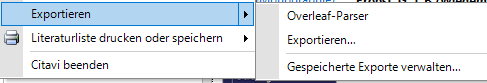
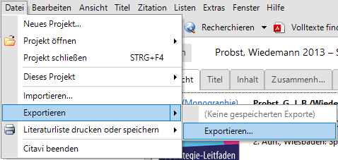
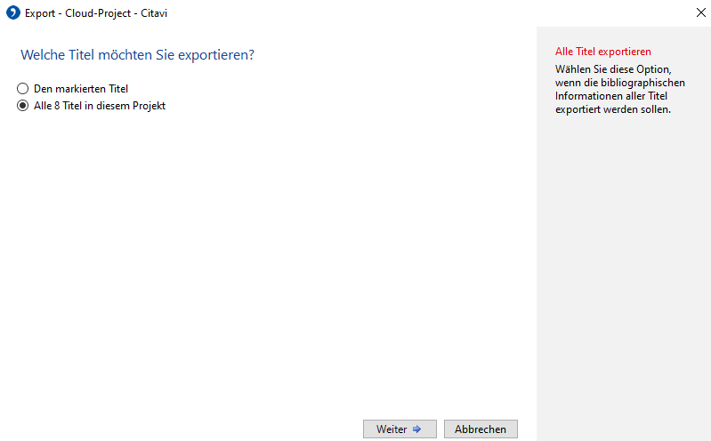
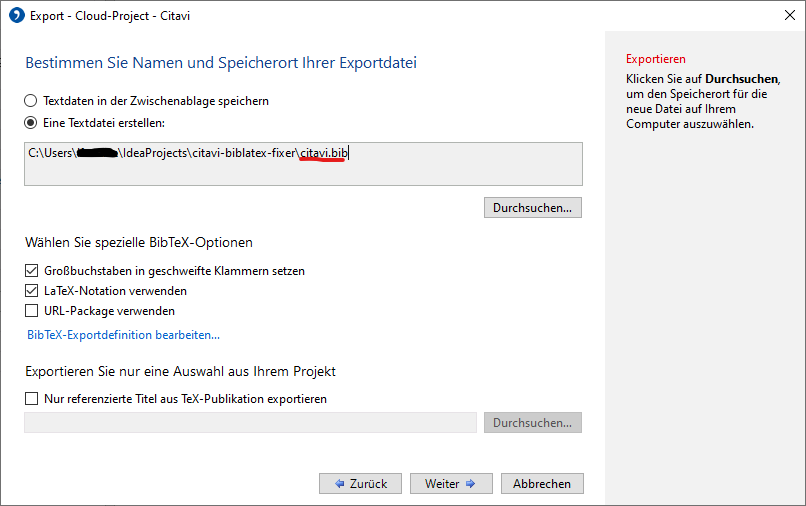
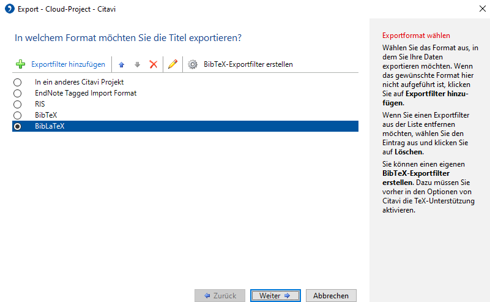
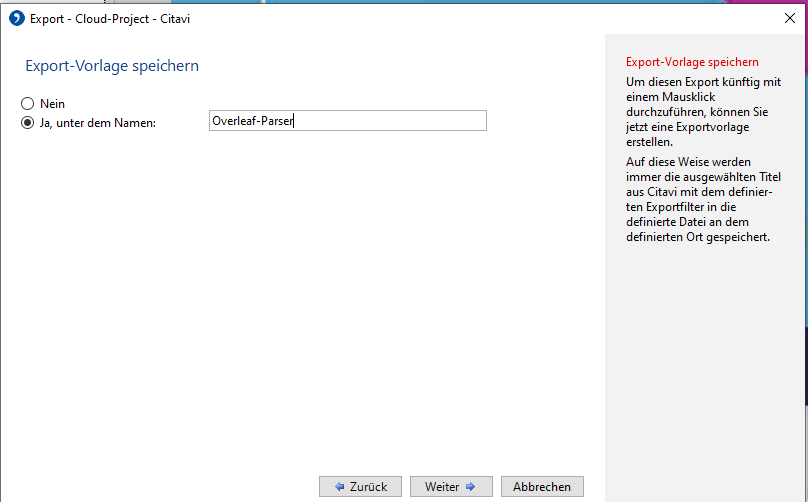

# citavi-biblatex-fixer
This repo contains js code to fix the biblatex output of Citavi for the DHBW citation style (removes isbn, doi, abstract, ...)

## Configure Biblatex export in Citavi
### Prerequesites  
You need to have node.js installed  
You need to execute `npm install` in this directory  
You need to follow the instructions below to configure a file export in Citavi.
### Enable LaTeX Support

## Create Export Profile

=> Replace the file in this folder

=> voila, you can now call this export at any time and it exports right in this directory.

### Execute the script
Now use `node index.js` to get the correct biblatex output in your clipboard